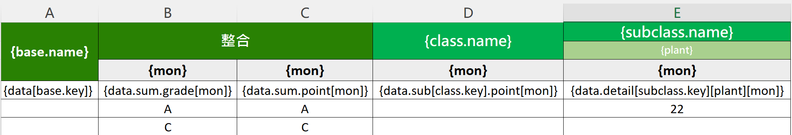
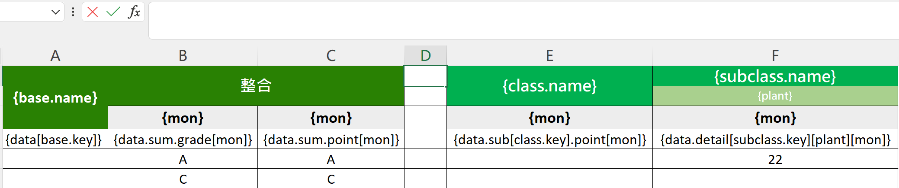

使用教学
====

## 一. 准备变量的json

需要一个JSON对象，例如

```json
{
  "base": [
    {
      "name": "brand",
      "key": "brand"
    },
    {
      "name": "product",
      "key": "product"
    }
  ],
  "type": [
    "grade",
    "point"
  ],
  "mon": [
    10,
    11,
    12
  ],
  "class": [
    {
      "key": "cost",
      "name": "成本"
    },
    {
      "key": "delivery",
      "name": "交期"
    },
    {
      "key": "quality",
      "name": "品質"
    },
    {
      "key": "esg",
      "name": "永續"
    },
    {
      "key": "design",
      "name": "設計"
    }
  ],
  "subclass": [
    {
      "key": "delivery",
      "name": "交期"
    },
    {
      "key": "quality",
      "name": "品質"
    },
    {
      "key": "esg",
      "name": "永續"
    }
  ],
  "plant": [
    "F131",
    "F214",
    "F132",
    "F216",
    "F721"
  ],
  "keyName": "work",
  "level1": {
    "level2": "yes"
  }
}
```

## 二. 准备数据的json

需要一个JSON数组

## 三. 准备模板的excel



以`{}`包裹，表示此为变量，而非纯字符

### 1. 表头会自动根据你的样式和变量向右进行填充

会找变量的key对应的value

- 对象数组：例如base.name，就是取出下面对象数组的所有name，向右扩展填充
    ```json
    [
      {
        "name": "brand",
        "key": "brand"
      },
      {
        "name": "product",
        "key": "product"
      }
    ]
    ```
- 基本类型数组：例如mon，找出数组中的所有元素，向右扩展填充
    ```json
    [10, 11, 12]
    ```

### 2. 表身会自动根据表头变量对应的value，取出数据向下进行填充
表头向右扩展的过程中，可以记住每列的变量  
比如base.name展开的时候，可以存储第一列变量key为base，value为以下内容

```json
{
  "name": "brand",
  "key": "brand"
}
```
那么在表身填充数据的时候可以获取到存储的变量的内容，比如base.key取到`brand`，就可以填充到`[]`中，该列的数据从`data[base.key]`变为 `data.brand`  
而data是一个对象数组，所以可以取到所有的brand的数据，向下填充

**注**：data可以省略不写，这样是同义词
- [base.key] 等同于 data[base.key]
- .sum.grade[mon] 等同于 data.sum.grade[mon]

---
到这里就是该组件的主要操作

### 1. 插入空列

插入一行并在第一个单元格里面填充空格，达到自己想要的宽度
